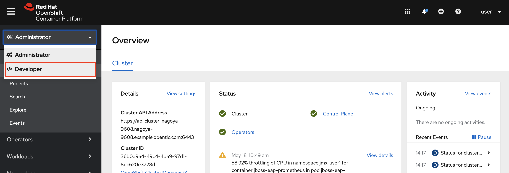
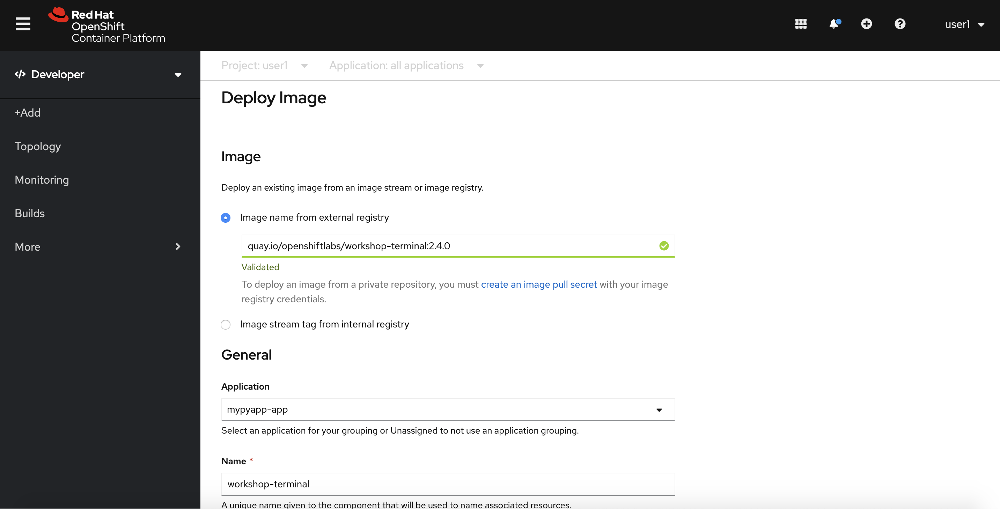
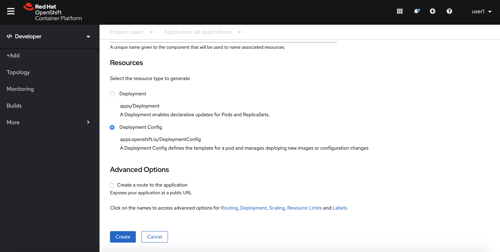
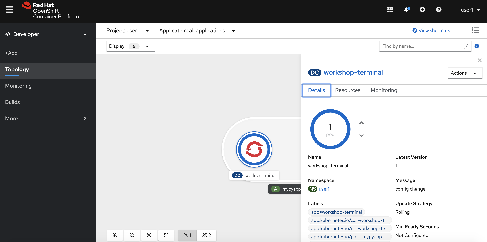
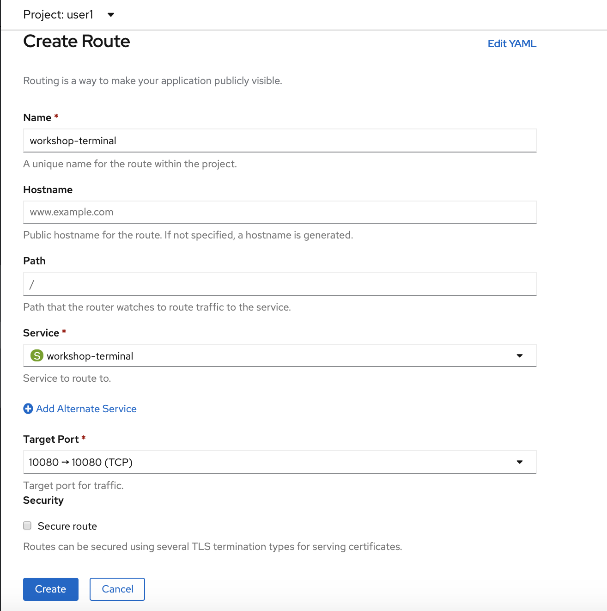
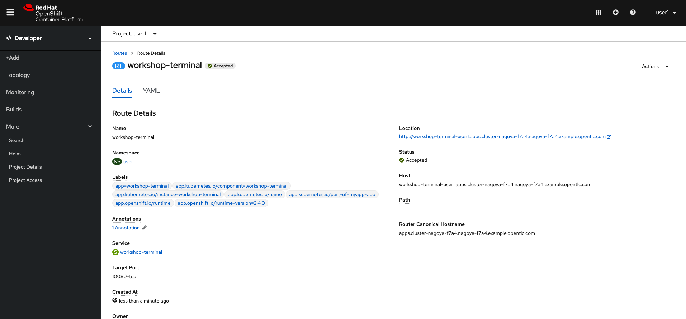
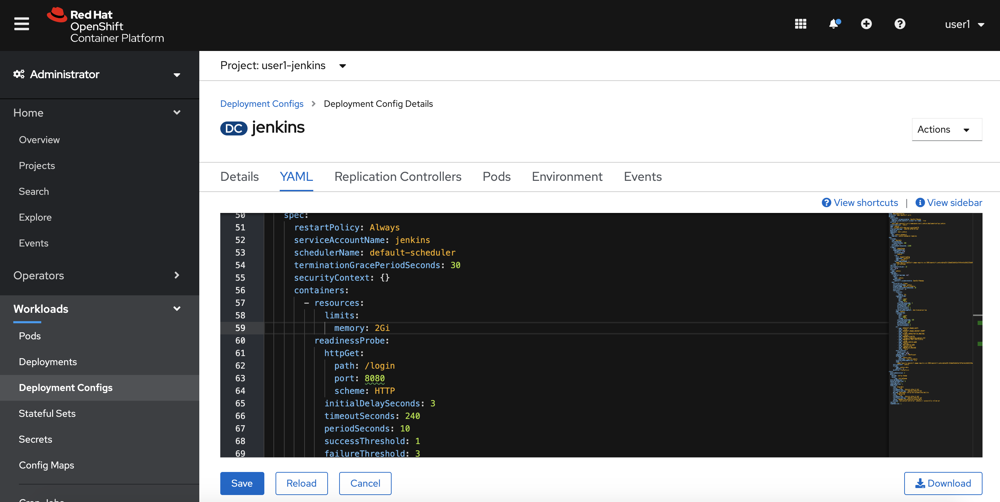
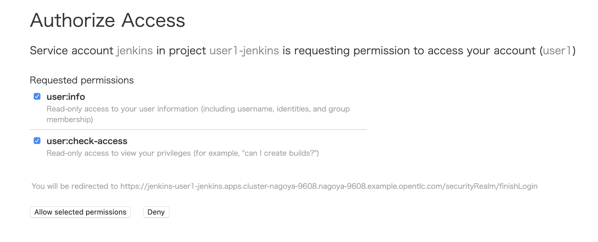

# Lab2: Jenkinsベースのビルドパイプライン
- 既存コンテナイメージをシンプルにデプロイ
- Jenkinsを使用したビルドパイプライン体験

# 既存コンテナイメージを使ってOCPにデプロイ

前半ではs2iビルド(ソースコードをビルドテンプレートとbuidler imageによってビルドする方法)によってコンテナイメージを作成し，OCP上にデプロイしました。後半の最初のステップでは，**すでにコンテナイメージになっている**ターミナルアプリケーションをOCP上にデプロイします。

1. プロジェクトを選択します

    プロジェクトは，**必ずご自身のログイン時のユーザー名 (例: "dev01")** のものを選択してください。    
    Home > Project > dev01 (例)
    
    
2. Developerコンソールへ切り替えます。

    


3. **+Add** > **Container Image** を選択します

    

4. **Image Name** を指定します
    - Image name from external registry: `quay.io/openshiftlabs/workshop-terminal:2.4.0`

    

5. Name(workshop-terminal)、Resources（Deployment Config)を確認して，**Create** を選択します

    Podが起動するまで待ちます。

    

6. 外部からアクセスするための **Route** を作成します

    Administoratorコンソールへ切り替えた後、  
    Networking > Routes > Create Route を選択し，以下を指定した後 **Create** を選択します
    - Name: `Route名(例: workshop-terminal)`
    - Service: `対象アプリ用のService(例: workshop-terminal)`
    - Target Port: `10080 → 10080(TCP)`

    

7. Location欄にあるリンクを開きます
    例: `http://workshop-terminal-dev01.apps.cluster-tokyo-ef76.tokyo-ef76.openshiftworkshop.com/`

    

8. Terminalアプリが表示されることを確認します

    

# [Trial works] - OCP上にアプリをデプロイ2
お題: 

「**workshop-terminalアプリの特定バージョン(2.10.2)を新規にデプロイして，Routerの転送先サービスを変更してみよう**」

ヒント:

```
- 既存Project名(Namespace): <yourID>
- ContainerImage: quay.io/openshiftlabs/workshop-terminal:2.10.2
- 新規デプロイ時に指定する名前: workshop-terminal-v2
- Service名: workshop-terminal-v2
  - Routeからの振り先Service
- Route名: workshop-terminal
  - 振り先を指定する
```

# Jenkinsベースのビルドパイプライン
CI(継続的インテグレーション)ツールとして有名なJenkinsを使ってビルドパイプラインを作成してみましょう。

実際の手順は以下のとおりです。
- JenkinsコンテナをOCP上で動作させる
- Jenkinsにパイプライン設定を入れる

GUIで操作することも可能ですが、今回はCLI操作をメインにして進めてみましょう。

1. 自身用の新規プロジェクト **devXX-jenkins** を作成します  **(例: dev01-jenkins)**

    ```
    $ oc login https://<クラスタURL>:6443
    The server uses a certificate signed by an unknown authority.
    You can bypass the certificate check, but any data you send to the server could be intercepted by others.
    Use insecure connections? (y/n): y
    
    Authentication required for https://api.cluster-nagoya-4fcb.nagoya-4fcb.example.opentlc.com:6443 (openshift)
    Username: user1
    Password: 
    Login successful.
    
    You have access to 59 projects, the list has been suppressed. You can list all projects with 'oc projects'
    
    Using project "default".
    Welcome! See 'oc help' to get started.
    
    $ oc new-project dev01-jenkins (<== ご自身のプロジェクト名)
    Now using project "user1-jenkins" on server "https://api.cluster-nagoya-4fcb.nagoya-4fcb.example.opentlc.com:6443".
    
    You can add applications to this project with the 'new-app' command. For example, try:

    oc new-app ruby~https://github.com/sclorg/ruby-ex.git
    
    to build a new example application in Python. Or use kubectl to deploy a simple Kubernetes application:

    kubectl create deployment hello-node --image=gcr.io/ hello-minikube-zero-install/hello-node
    
    $ oc project
    Using project "dev01-jenkins" on server XXXXXXX
    
    上記のように出力確認できればOKです
    ```

2. Jenkinsテンプレートを使用してJenkinsのインスタンスをデプロイします

    ```
    $ oc get templates -n openshift | grep jenkins

    jenkins-ephemeral: 永続化なし <== 今回はこちらを使用
    jenkins-persistent: 永続化あり

    $ oc new-app jenkins-ephemeral
    :
    --> Creating resources ...
    route.route.openshift.io "jenkins" created
    deploymentconfig.apps.openshift.io "jenkins" created
    serviceaccount "jenkins" created
    rolebinding.authorization.openshift.io "jenkins_edit" created
    service "jenkins-jnlp" created
    service "jenkins" created
    
    --> Success
    Access your application via route 'jenkins-user1-jenkins.apps.cluster-nagoya-4fcb.nagoya-4fcb.example.opentlc.com' 
    Run 'oc status' to view your app.
    
    $ oc get pods -w
    NAME               READY   STATUS              RESTARTS   AGE
    jenkins-1-4mzx6    0/1     ContainerCreating   0          4s
    jenkins-1-deploy   1/1     Running             0          6s
    jenkins-1-4mzx6    0/1     ContainerCreating   0          11s
    :
    
    # ctrl-c でwatch状態から抜けられます
    ```

3. Jenkinsのメモリ上限を増やします。openshiftコンソールから

    Workloads > Deployment Configs > jenkins > YAML と選び、下記画像のようにspec.template.spec.containers.resources.limiits.memoryを2Giに変更してsaveしてください。
    
    
    
4. Jenkinsにパイプライン設定(nodejs-sample-pipeline)を入れます

    ```
    $ oc create -f https://raw.githubusercontent.com/openshift/origin/master/examples/jenkins/pipeline/nodejs-sample-pipeline.yaml
    
    $ oc get buildconfigs
    NAME                     TYPE              FROM   LATEST
    nodejs-sample-pipeline   JenkinsPipeline          0      # oc createで作成されたPipeline
    
    $ oc get buildconfig/nodejs-sample-pipeline -o yaml　# 中身を確認
    ```

5. パイプラインを使用してビルドします

    ```
    $ oc start-build nodejs-sample-pipeline
    ```

6. JenkinsのUIに接続してパイプラインの進捗状況を確認します

    ```
    $ oc get route
    出力結果のLocation情報をコピーしてブラウザで確認します
    ```
    
    OCPのログイン情報を使用してJenkinsのUIにログインします
    
    
    
    users.htpasswdを選択し，その後ログイン情報を入力します(例: dev01/openshift)

    
    
    以下のような画面が出た場合は、[Allow selected permissions]を選択します。

    

    
    **自身のプロジェクト名** を選択します(例: dev01-jenkins)
    
    

    **プロジェクト名/パイプライン名** を選択します (例: dev01-jenkins/nodejs-sample-pipeline)
    
    

    時間経過とともにパイプラインのステージがだんだん右側に伸びていくことが確認できます

    

    ※パイプラインのステージの書き方は，前述の `oc get buildconfig/nodejs-sample-pipeline -o yaml`で確認できます

>Tips:
>
>ちなみに，Lab1ではOCPコンソール上でGUI操作で上記と同様の作業を行っていました。
>具体的には，**カタログ(Developer Catalog)** からPythonテンプレートを選択して，ソースコードとbuilder image(Python)を合体させることでコンテナイメージを作成し，デプロイしていました。
>また，OCPではJenkinsに限らず，ランタイムや他ミドルウェア，ソフトウェアなど多数のテンプレートを用意しています。自身(自社)でよく使うテンプレートを自作してカタログ上に追加することも可能です。(既存のbuilder imageの挙動をカスタマイズする場合には、S2Iビルドスクリプトを作成してオーバーライドします。)
>
>他にもCI/CDを試したい場合は下記リンクを参照下さい。
>https://adoc.redhat.partners/?https%3A%2F%2Fadoc.redhat.partners%2Flab%2Focp-workshop-dev-cicd.adoc.REPL&no-header-footer&numbered=&toc!
