# Lab3: 複数コンテナの連携

- テンプレートからMongoDBを構築
- テンプレートからNode.jsアプリケーションを作成
- Node.jsアプリケーションのsecretを設定し、MongoDBと繋げる

# MongoDBを構築
Node.jsアプリケーションを作成し、MongoDBと接続する上で必要な情報を設定し連携させます。まずはMongoDBから構築していきます。

1. プロジェクトを選択します

    プロジェクトは，**必ずご自身のログイン時のユーザー名 (例: "dev01")** のものを選択してください。
    Home > Project > dev01　 (例)

    

1. Developerコンソールへ切り替えます。

    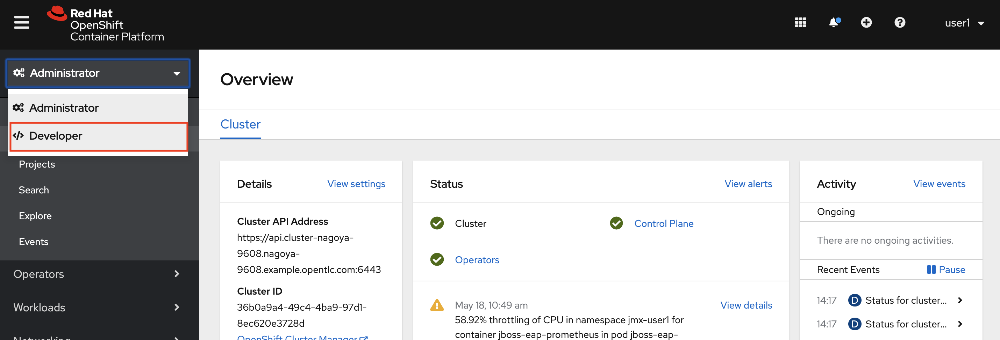

1. +Add > From Catalog と選択し、「mongodb (ephemeral)」と検索し、MongoDB(Ephemeral)を選択してください。

    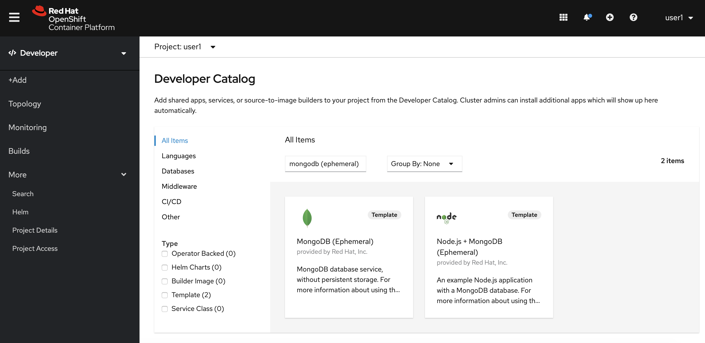

1. [Instantiate Template] をクリックしたら下記のような画面になります。そのままCreateをクリックしてください。
  
    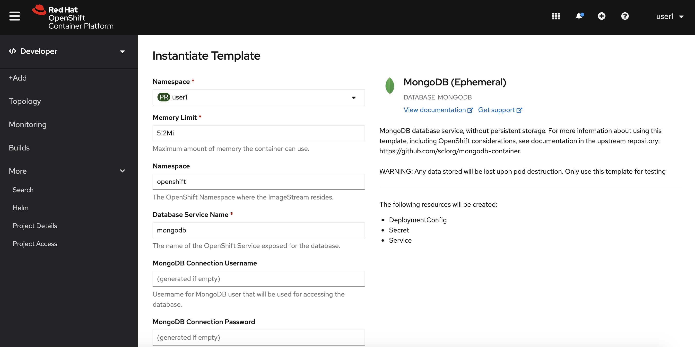

# Node.jsアプリケーションを構築

1. 次にNode.jsのアプリケーションを構築します。Developerコンソールへ切り替えます。

    

1. From Catalog > Languages > JavaScript と進み、

   Node.jsを選択してください。(Node.js + MongoDBや、Node.js + MongoDB(Ephemeral)ではありません)

   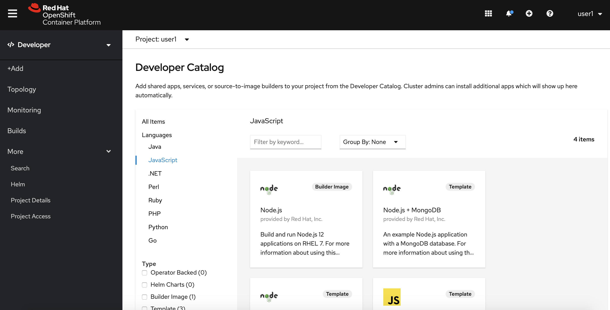

2. Create Applicationを選択したら、下記のように  
 Git Repository:  https://github.com/openshift/nodejs-ex.git  
 Application Name/ Name: <ユーザー名>-multi-pod-app  
を入れ、Createを選択してください。

   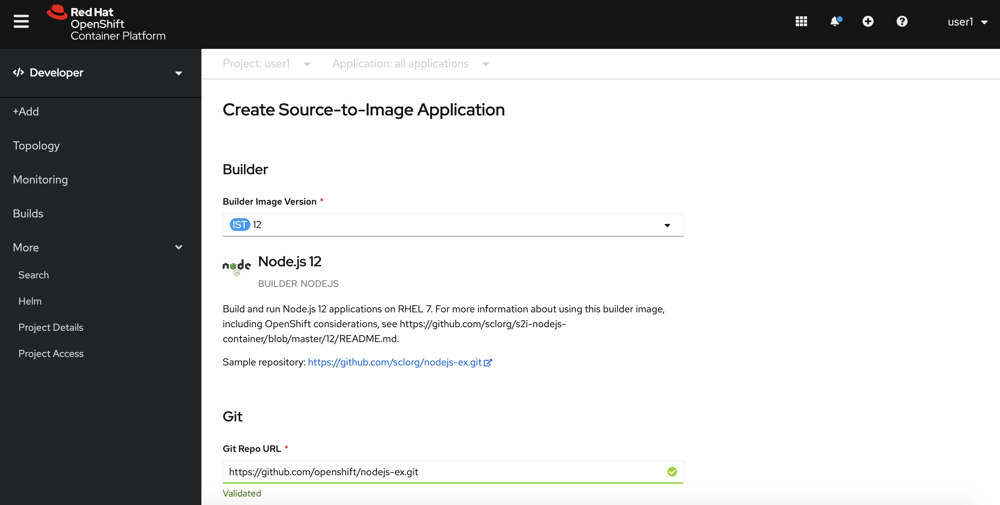
   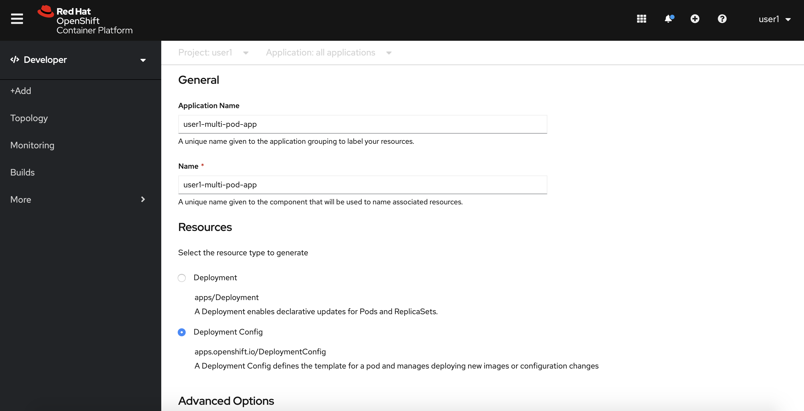
   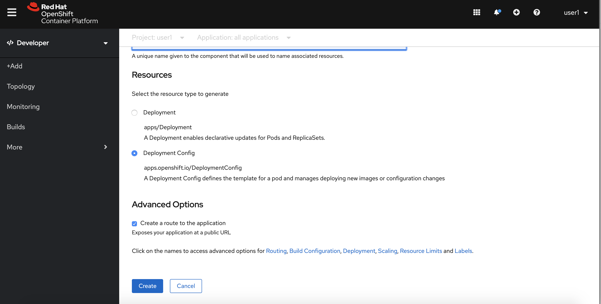

3. 作成したアプリケーションアイコンを選択して、[Resources]内の[Routes]を確認します。ビルド、デプロイが終わったら、Locationのリンクを選択するとアプリケーションのデフォルトページに遷移します。右下の「Page view count」が「No database configured」になっていることを確認してください。

   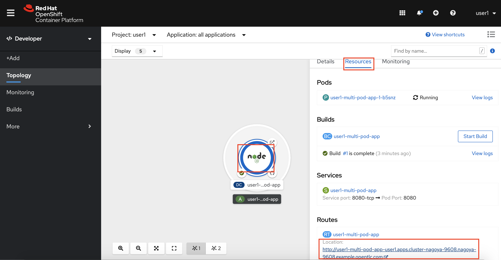

# Node.jsとMongoDBを繋げる

1. 最後に作成したNode.jsアプリケーションからMongoDBに接続する設定を行います。

   作成したアプリケーションアイコンを選択して、DC:<ユーザ名>-multi-pod-appを選択してください。

   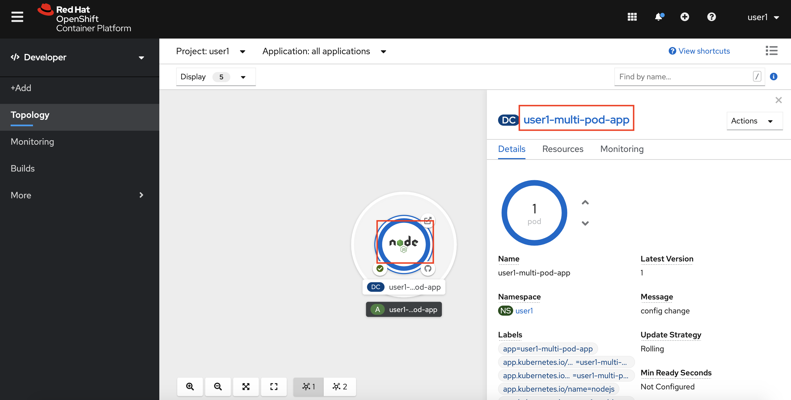

   [Environment]ページの Single values (env) の下にNAME, VALUEと入力できる箇所があるので、それぞれ下記のように入れていきます。

   | | NAME                   | VALUE                            |
   |-- | ---------------------- | -------------------------------- |
   |Add from Config Map or Secret | MONGODB_USER           | [S]mongodb > database-user|
   |Add from Config Map or Secret | MONGODB_DATABASE       | [S]mongodb > database-name|  |
   |Add from Config Map or Secret | MONGODB_PASSWORD       | [S]mongodb > database-password| |
   |Add from Config Map or Secret | MONGODB_ADMIN_PASSWORD | [S]mongodb > database-admin-password| |
   |Add Value | DATABASE_SERVICE_NAME  | mongodb (固定値)                 |

   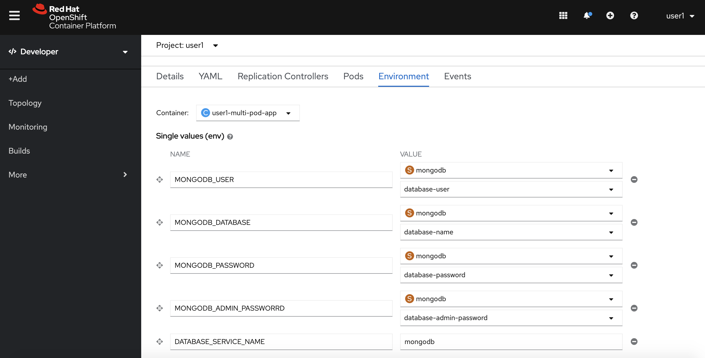

2. 設定が終わったら[Save]を選択後、先ほどのアプリケーションのページに遷移してください。下記のようにPage view countが加算されるようになれば設定成功です。設定が反映されるまで時間がかかるので、うまくいかない場合はしばらくたってからリロードして確認してください。

   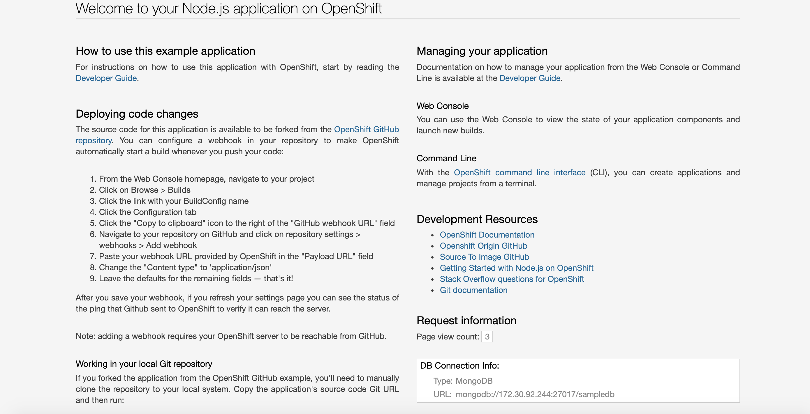

    >Tips:
    >
    >Secretとして保存されている実際の値は、Administoratorコンソール - Workloads - Secrets - mongodb - Data で[Reveal Values]から確認できます。
