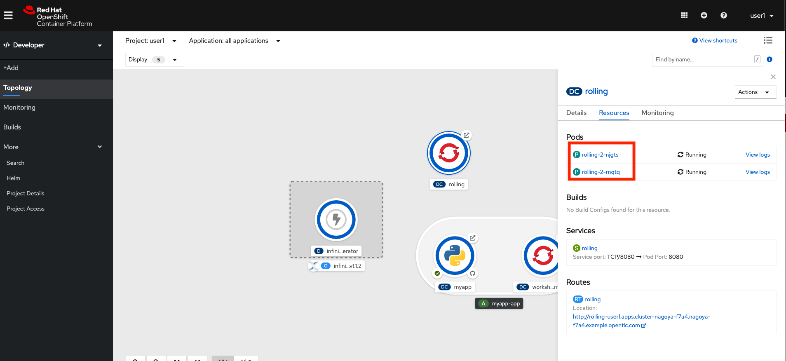

# Lab4: 様々なデプロイメント手法

- Blue Green Deployment
- Canary Deployment
- Rolling Deployment

# Blue Green Deployment
Blue Green Deploymentとは、異なるバージョンのアプリケーションを二つ作り、Load Balancer(OCPの場合はRouterが内部LBとして機能します) の向き先を変更することでアプリケーションのバージョンを切り替える手法です。Blueが現行バージョン、Greenが新バージョンです。

1. プロジェクトを選択します。

    ```
    $ oc login https://api.cluster-tokyo-ef76.tokyo-ef76.openshiftworkshop.com:6443
    $ oc project ユーザー名 (ex. oc project dev01)
    ```

2. アプリケーション (Blue) を作成します。

    ```
    $ oc run blue --image=openshift/hello-openshift --replicas=2 --limits='cpu=500m,memory=128Mi'
    kubectl run --generator=deploymentconfig/v1 is DEPRECATED and will be removed in a future version. Use kubectl run --generator=run-pod/v1 or kubectl create instead.
    deploymentconfig.apps.openshift.io/blue created
    ```

3. 作成したアプリケーションのレスポンスを設定します。(このサンプルアプリケーションは環境変数によってレスポンスメッセージが設定可能になっています)

    ```
    $ oc set env dc/blue RESPONSE="Hello from Blue"
    deploymentconfig.apps.openshift.io/blue updated
    ```

4. サービスを作成します。

    ```
    $ oc expose dc/blue --port=8080
    service/blue exposed
    ```

5. サービスを外部公開します。

    ```
    $ oc expose svc/blue --name=bluegreen
    route.route.openshift.io/bluegreen exposed
    ```

6. 別バージョンのアプリケーション (Green) を作成します。

    ```
    $ oc run green --image=openshift/hello-openshift --replicas=2 --limits='cpu=500m,memory=128Mi'
    kubectl run --generator=deploymentconfig/v1 is DEPRECATED and will be removed in a future version. Use kubectl run --generator=run-pod/v1 or kubectl create instead.
    deploymentconfig.apps.openshift.io/green created

    $ oc set env dc/green RESPONSE="Hello from Green"
    deploymentconfig.apps.openshift.io/green updated

    $ oc expose dc/green --port=8080
    service/green exposed
    ```

7. トラフィックをBlueに設定します。

    ```
    $ oc set route-backends bluegreen blue=100 green=0
    route.route.openshift.io/bluegreen backends updated
    ```

8. 別のターミナルを開き、今どちらのアプリケーションに向いているのか確認します。

    ```
    $ oc get route bluegreen
    NAME        HOST/PORT                                                                 PATH   SERVICES               PORT   TERMINATION   WILDCARD
    bluegreen   bluegreen-user1.apps.cluster-nagoya-9608.nagoya-9608.example.opentlc.com          blue(100%),green(0%)   8080                 None

    $ while true; do curl http://<oc get routeで取得したエンドポイント>; sleep .5; done
    
    Hello from Blue
    Hello from Blue
    Hello from Blue
    Hello from Blue
    Hello from Blue
    Hello from Blue
    
    ...
    ```

9. 今度はトラフィックをGreenに向けます。

    ```
    $ oc set route-backends bluegreen blue=0 green=100
    route.route.openshift.io/bluegreen backends updated
    ```

10. 再びアクセスすると、別のバージョンに切り替わっていることが確認できます。

    ```
    $ while true; do curl http://oc get routeで取得したエンドポイント; sleep .5; done
    
    Hello from Green
    Hello from Green
    Hello from Green
    Hello from Green
    Hello from Green
    Hello from Green
    ...
    ```
    確認後、Ctrl+Cで停止します。

# Canary Deployment

Canary Deploymentは異なるバージョンのアプリケーションを二つ作り、トラフィックを少しずつ新しいバージョンへ流して、問題が無ければそのまま全て切り替える手法です。

1. プロジェクトを選択します。

   ```
    $ oc login https://api.cluster-tokyo-ef76.tokyo-ef76.openshiftworkshop.com:6443
   $ oc project ユーザー名 (ex. oc project dev01)
   ```

2. アプリケーションを作成します。

   ```
   $ oc run prod --image=openshift/hello-openshift --replicas=2 --limits='cpu=500m,memory=128Mi'
   kubectl run --generator=deploymentconfig/v1 is DEPRECATED and will be removed in a future version. Use kubectl run --generator=run-pod/v1 or kubectl create instead.
   deploymentconfig.apps.openshift.io/prod created

   $ oc set env dc/prod RESPONSE="Hello from Prod"
   deploymentconfig.apps.openshift.io/prod updated

   $ oc expose dc/prod --port=8080
   service/prod exposed

   ```

3. サービスを作成します。

   ```
   $ oc expose svc/prod
   route.route.openshift.io/prod exposed
   ```

4. 次に別バージョンのアプリケーションを作成します。

   ```
   $ oc run canary --image=openshift/hello-openshift --limits='cpu=500m,memory=128Mi'
   kubectl run --generator=deploymentconfig/v1 is DEPRECATED and will be removed in a future version. Use kubectl run --generator=run-pod/v1 or kubectl create instead.
   deploymentconfig.apps.openshift.io/canary created
   
   $ oc set env dc/canary RESPONSE="Hello from Canary"
   deploymentconfig.apps.openshift.io/canary updated

   $ oc expose dc/canary --port=8080
   service/canary exposed

   $ oc set route-backends prod prod=100 canary=0
   route.route.openshift.io/prod backends updated
   ```

5. 別のターミナルを開き、トラフィックが片方に寄っていることを確認します。

   ```
   $ oc get route prod
   NAME   HOST/PORT                                                             PATH   SERVICES                PORT   TERMINATION   WILDCARD
   prod   prod-user1.apps.cluster-nagoya-9608.nagoya-9608.example.opentlc.com          prod(100%),canary(0%)   8080                 None
   
   $ while true; do curl http://<oc get routeで取得したエンドポイント>; sleep .5; done
   
   Hello from Prod
   Hello from Prod
   Hello from Prod
   Hello from Prod
   Hello from Prod
   ...
   ```

6. トラフィックの配分を変更します。

   ```
   $ oc set route-backends prod prod=90 canary=10
   route.route.openshift.io/prod backends updated
   ```

7. もう一度リクエストを送り、今度はトラフィックが分配されていることを確認します。

   ```
   $ while true; do curl http://oc get routeで取得したエンドポイント; sleep .5; done
   
   Hello from Prod
   Hello from Prod
   Hello from Prod
   Hello from Prod
   Hello from Prod
   Hello from Prod
   Hello from Prod
   Hello from Prod
   Hello from Prod
   Hello from Prod
   Hello from Canary
   Hello from Prod
   Hello from Prod
   ...
   ```
   確認後、Ctrl+Cで停止します。

# Rolling Update

Rolling Updateは新しいバージョンのアプリケーションのPodを少しずつ増やし、古いバージョンのアプリケーションのPodを少しずつ減らして入れ替えていく手法です。

1. プロジェクトを選択します。

   ```
   $ oc login 接続先クラスタ
   $ oc project ユーザー名 (ex. oc project dev11)
   ```

2. アプリケーションを作成します。

   ```
   $ oc run rolling --image=openshift/hello-openshift --replicas=2 --limits='cpu=500m,memory=128Mi'
   kubectl run --generator=deploymentconfig/v1 is DEPRECATED and will be removed in a future version. Use kubectl run --generator=run-pod/v1 or kubectl create instead.
   deploymentconfig.apps.openshift.io/rolling created
   
   $ oc expose dc/rolling --port 8080
   service/rolling exposed

   $ oc expose svc/rolling
   route.route.openshift.io/rolling exposed
   ```

3. アプリケーションから返されるレスポンスを設定します。

   ```
   $ oc set env dc/rolling RESPONSE="Hello from new roll"
   deploymentconfig.apps.openshift.io/rolling updated
   ```

4. Workloads > Deployment Configs > rolling > Podsを確認します。

   

5. 別のターミナルを開き、レスポンスを確認します。

   ```
   $ oc get route rolling
   NAME      HOST/PORT                                                                PATH   SERVICES   PORT   TERMINATION   WILDCARD
   rolling   rolling-user1.apps.cluster-nagoya-9608.nagoya-9608.example.opentlc.com          rolling    8080                 None
   
   $ while true; do curl http://<oc get routeで取得したエンドポイント>; sleep .5; done
   
   Hello from new roll
   Hello from new roll
   Hello from new roll
   ...
   ```

6. レスポンスを変更します。

   ```
   $ oc set env dc/rolling RESPONSE="Hello from second roll"
   deploymentconfig.apps.openshift.io/rolling updated
   ```

7. 再度レスポンスを確認し、変更されていることを確認します。

   ```
   $ oc get route rolling
   $ while true; do curl http://oc get routeで取得したエンドポイント; sleep .5; done
   
   Hello from second roll
   Hello from second roll
   Hello from second roll
   ...
   ```

8. Workloads > Deployment Configs > rolling > Podsを再度確認し、Pod名が変わっていることを確認します。

   

   