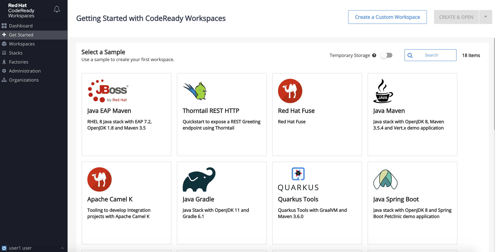
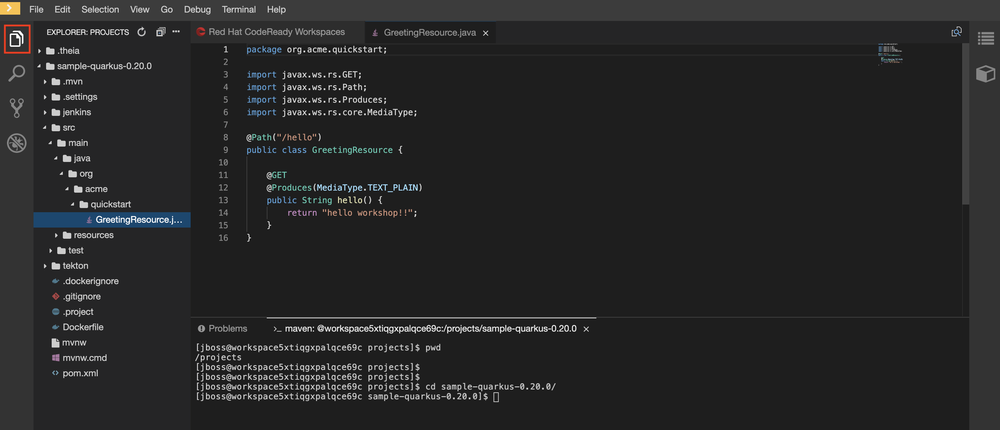

# Lab5: CodeReady Workspaceを利用した開発体験

- CodeReady Workspaceのインストール
- サンプルアプリケーションの開発とOpenshiftへのデプロイ

# CodeReady Workspaceのインストール
OpenShift上にCodeReadyをインストールします。すでにCodeReady Workspaceがインストール済みで、workspaceも用意済みであれば当セクションは飛ばして構いません。次セクションの「サンプルアプリケーションの開発とOpenshiftへのデプロイ」の 2 まで進んでください。

1. プロジェクトを選択します

   プロジェクトは，**必ずご自身のログイン時のユーザー名 (例: "dev01")** のものを選択してください。
   Home > Project > dev01　 (例)

   

2. Operators > OperatorHub と進み、検索窓に「CodeReady」と入力してください。CodeReadyのitemが表示されたら選択してください。

    

3. installします。

    

4. 御自身のprojectがインストール先に選択されていることを確認して、Subscribeを選択してください。

    

5. Operatorがinstallされました。これを元にproject にCodeReadyのアプリケーションを作成します。Operators > Installed Operators と進み、「Red Hat CodeReady Workspaces」を選択します。表示されない場合は、まだOperatorのインストールが終わっていない状態ですのでしばらくたってから再度確認してみてください。

    

6. Create Instanceを選択します。

    

7. そのままCreateします。

    

8. Createが開始されました。時間がかかるのでしばらくお待ちください。

    

9. Workloads > Deployments と進み、下記のように必要なResouceが作成されたら完了です。

    

10. Networking > Routes と進み、codereadyのLocationに表示されているURLを選択してください。

    

11. OpenShiftのコンソールログイン画面が表示されますので、OpenShiftのユーザ/パスワードでログインします。また、Autorize Access画面が表示された場合は、[Allow selected permissions]を選択します。。

     
     

12. ユーザ情報を任意で入力してSubmitを選択してください。

    

13. 下記のような画面が表示されたらCodeReadyの準備は完了です。

    

# サンプルアプリケーションの開発とOpenshiftへのデプロイ

ここからインストールしたCodeReady上で[Quarkus](https://quarkus.io/)アプリケーションを作成、デプロイしていきます。

1. Get Started画面で、[Create a Custom Workspace]を選択します。

   
   
2. SELECT STACKで、Java Mavenを選択します。

   

3.  PROJECTSで、デフォルトのサンプルプロジェクトを[Remove]して、[+ Add or Import Project]を選択し、[Git]として下記のURLを入力後[Add]します。その後、[CREATE & OPEN]を選択します。ワークスペースが作成されるまで少し待ちます。  
Repository URL： https://github.com/16yuki0702/sample-quarkus-0.20.0.git  
   

4. ワークスペースが表示されるので、上部メニューの[Terminal]-[Open Terminal in specific container] を選択後、[Maven]を指定します。

   
   


5. 右下にTerminalが開かれます。cdコマンドでカレントディレクトリを「/projects/sample-quarkus-0.20.0」へ移動してください。以降このディレクトリ内で作業を行います。Terminalのタブをダブルクリックすると画面が大きくなります。  

   

    また左上のドキュメントアイコンをクリックするとプロジェクトエクスプローラが表示され、ソースなどファイルが確認できます。

   

6. CodeReady上からOpenshift にログインします。下記コマンドを打ち、それぞれに割り当てられたユーザー名(例：user1)とパスワードを入力してください。

   ```
   $ oc login https://<openshiftクラスタ>
   ```

7. ログインしたら下記コマンドで自分専用のproject を作成してください。他とproject名が重複するとエラーになりますので、打ち間違いがないか確認してください。

   ```
   $ oc new-project <ユーザー名-app>
   Now using project "user1-app" on server "https://api.cluster-nagoya-9608.nagoya-9608.example.opentlc.com:6443".
   
   You can add applications to this project with the 'new-app' command. For example, try:

    oc new-app centos/ruby-25-centos7~https://github.com/sclorg/ruby-ex.git
    
    to build a new example application in Ruby.
   ```

8. プロジェクトを作成したら下記を入力し、正しいprojectにいるか確認してください。

   ```
   $ oc project
   Using project "user1-app" on server "https://api.cluster-nagoya-9608.nagoya-9608.example.opentlc.com:6443".
   ```

9. デプロイの準備を行っていきます。下記を入力し、build設定を作成します。  

   ```
   $ APP_NAME=quarkus-app
   $ oc new-build --strategy=docker --binary=true --name=$APP_NAME
   ```

   下記のようにsuccessと出れば成功です。

   

10. 下記コマンドを実行してビルドを開始します。このコマンドでは作成したビルド設定に対し自分の作業ディレクトリを指定しています。このようにすると作業中のディレクトリをopenshfitに転送してビルドすることができます。—followオプションを付けているのでbuild実行中のログが流れます。ビルドには時間がかかりますのでしばらくお待ちください。

    ```
    $ oc start-build $APP_NAME --from-dir=/projects/sample-quarkus-0.20.0 --follow
    ```

    下記のように「push successful」と出れば成功です。

    

11. ビルドしたイメージを元にアプリケーションを作成します。

    ```
    $ oc new-app $APP_NAME
    ```

    下記のように表示されれば作成成功です。

    

12. サービス公開設定をします。

    ```
    $ oc expose service $APP_NAME
    route.route.openshift.io/quarkus-app exposed
    ```

13. エンドポイントの確認をします。

    ```
    $ oc get route
    ```

    Locationの箇所にあるURLがサービスエンドポイントになります。URLにアクセスしてみてください。

    

14. アクセスして下記のような画面が表示されればデプロイ成功です。

    


### 応用問題

1. src/main/java/org/acme/quickstart/GreetingResource.java の中身を確認してみてください。helloと文字列を返しているクラスのはずです。デフォルトページではなく、GreetingResource.javaの画面を表示してみてください

2. src/main/java/org/acme/quickstart/ChallengeResource.java ファイルを下記のように作成し、再度デプロイしてみてください。追加されたChallengeResource.javaの画面が表示できるか確認してみてください。

   ```
   package org.acme.quickstart;
   
   import javax.ws.rs.GET;
   import javax.ws.rs.Path;
   import javax.ws.rs.PathParam;
   import javax.ws.rs.Produces;
   import javax.ws.rs.core.MediaType;
   
   @Path("/challenge")
   public class ChallengeResource {
       @GET
       @Produces(MediaType.TEXT_PLAIN)
       @Path("{param}")
       public String challenge(@PathParam("param") String param) {
           return String.format("Hello %s!", param);
       }
   }
   ```

